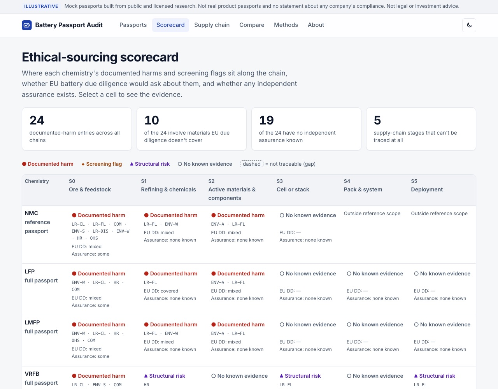
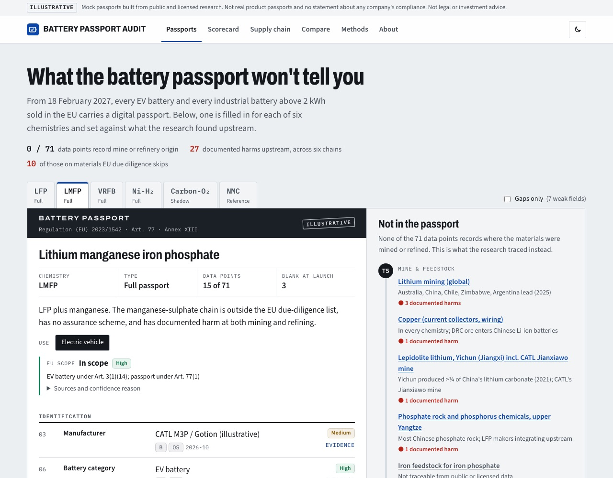
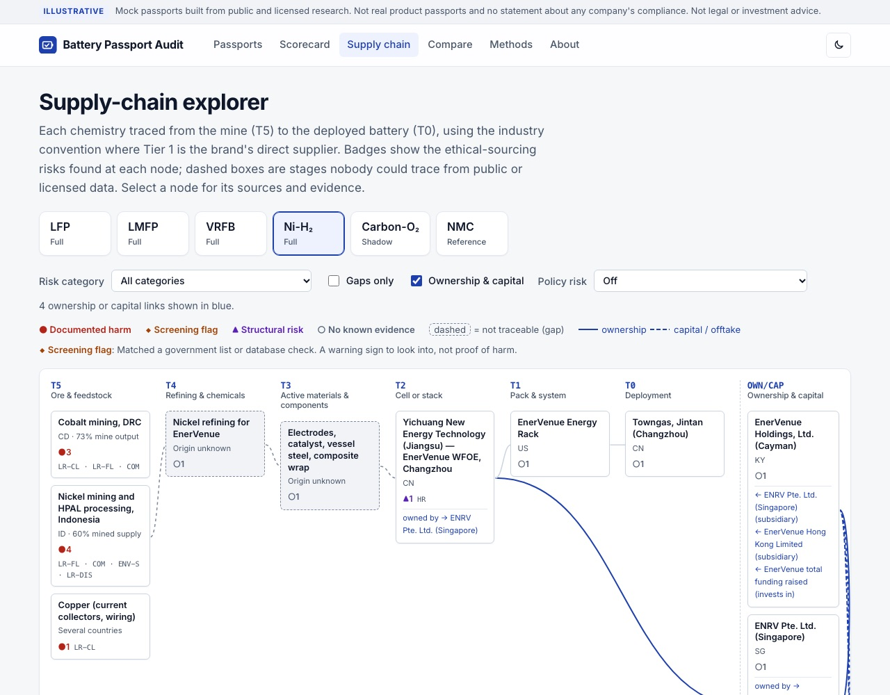
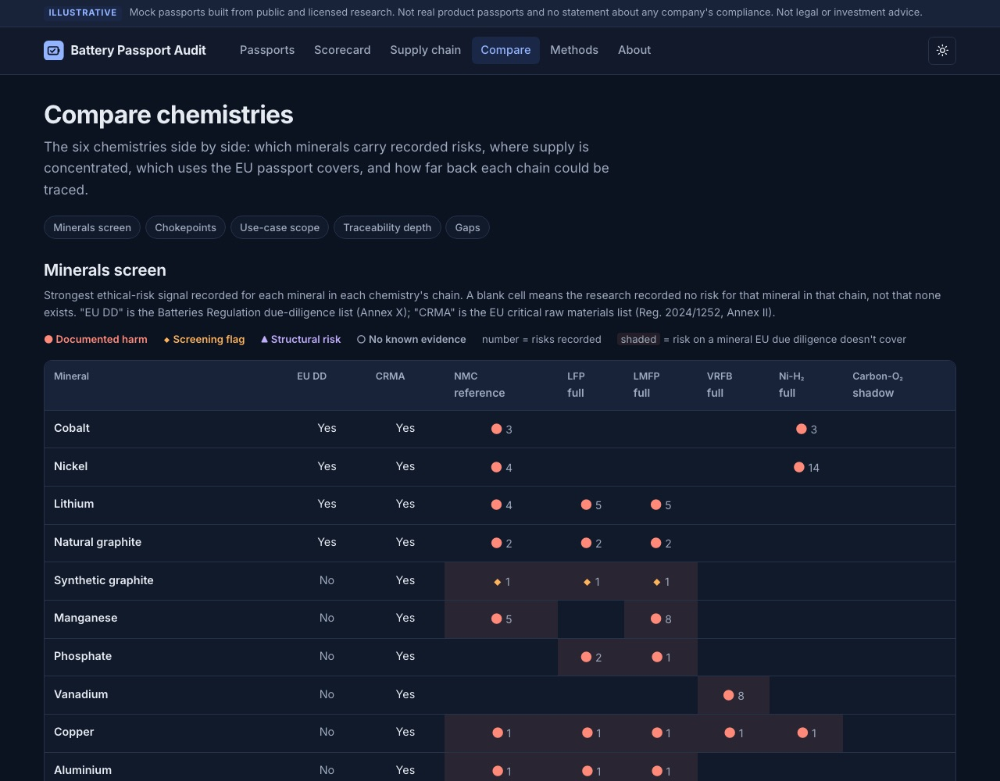

# Battery Passport Audit

An ethical-sourcing audit of the EU battery passport. Illustrative passports for six battery chemistries trace each supply chain from mine to deployment, and show where human-rights, labour, community and environmental risks sit, how much of each can be verified, and what the passport and EU due diligence would and wouldn't reveal.

**Live site:** https://indiaclarke03-ops.github.io/EthicalBatterySourcing/

> **Illustrative.** These are mock passports built from public and licensed research. They are not real product passports and make no statement about any company's compliance. Not legal or investment advice.

**Data as of:** October 2026 (policy items carry day-level dates; see [Re-check schedule](#re-check-schedule)).

Built by India Clarke with Claude Code, using Sayari and Tavily for research. See the [methods page](https://indiaclarke03-ops.github.io/EthicalBatterySourcing/methods.html#ai) for the AI-use disclosure.

## Why

- The EU battery passport becomes mandatory on **18 February 2027** (Reg. 2023/1542, Art. 77). The Commission's guidance defines 71 data points; none records where materials were mined or refined.
- Supply-chain due diligence was postponed to **18 August 2027** (Reg. 2025/1561) and covers four raw materials only: cobalt, natural graphite, lithium and nickel.
- Newer chemistries can look "cleaner" on paper because their risky inputs (phosphate, manganese, vanadium, copper, sulphuric acid) aren't on that list. **Changing chemistry moves risk; it doesn't remove it.**

## What's on the site

| Page | What it shows |
|---|---|
| [Passports](https://indiaclarke03-ops.github.io/EthicalBatterySourcing/) | A passport card per chemistry and use case, a "what this passport doesn't show" panel, a detail panel per field (sources, confidence, ethical-sourcing risks), a gaps filter and a mock QR code |
| [Scorecard](https://indiaclarke03-ops.github.io/EthicalBatterySourcing/scorecard.html) | Chemistry × supply-chain stage: strongest risk signal, EU due-diligence coverage, independent assurance |
| [Supply chain](https://indiaclarke03-ops.github.io/EthicalBatterySourcing/supply-chain.html) | Supply-chain explorer (T5 mine → T0 deployed battery) with risk-category filter, ownership & capital overlay, policy-risk overlay and gaps filter |
| [Compare](https://indiaclarke03-ops.github.io/EthicalBatterySourcing/compare.html) | Minerals screen, chokepoints, use-case scope matrix, traceability depth, gaps by chemistry |
| [Methods](https://indiaclarke03-ops.github.io/EthicalBatterySourcing/methods.html) · [About](https://indiaclarke03-ops.github.io/EthicalBatterySourcing/about.html) | Rubric, ethical-sourcing method, Sayari caveats, AI use; how the tool works and how to read it |

Chemistries: **LFP**, **LMFP**, **VRFB** (Rongke), **Ni-H₂** (EnerVenue) as full passports; **carbon-oxygen** (Noon Energy) as a shadow passport; **NMC** as a lighter reference baseline.

| Scorecard | Passport |
|---|---|
|  |  |
| **Supply chain (Ni-H₂, ownership overlay)** | **Compare (dark mode)** |
|  |  |

## Method in brief

- **Supply-chain tiers:** industry convention, counting back from the battery: T0 deployed battery/brand, T1 pack, T2 cell, T3 active materials, T4 refining, T5 mine. (Data files use internal stage codes S5…S0 for the same tiers.)
- **Evidence grades:** A primary (regulation, regulator, filing, company statement *as a statement*); B credible secondary or licensed database; C weaker. (Data files store these as T1–T3.)
- **Provenance tags:** S-REG / S-TRADE (Sayari registry / trade), OS (open source), INF (inference), GAP (no usable source).
- **Confidence:** High, Medium, Low or Unknown, each with a one-line reason, applied by one rubric to every chemistry. Conflicting values are shown side by side, never averaged.
- **Ethical-sourcing profile per node:** risk category (EU Batteries Regulation Annex X), signal type (documented harm, screening flag, structural risk, no known evidence), assurance (IRMA, RMI/RMAP, other, self-assessment, none known) and EU due-diligence coverage.
- **Rules:** a screening flag is never presented as harm; database forced-labour flags are shown only in aggregate unless publicly corroborated; official government-list entities (UFLPA, Section 1260H) are named with the list's basis and date; no individuals are named; unverifiable claims are recorded as gaps.

Full method: [`methods.html`](methods.html) and [`PLAN.md`](PLAN.md#method).

## Repository layout

```
index.html, scorecard.html, supply-chain.html, compare.html, methods.html, about.html
assets/            app.js (shared helpers), styles.css, fonts/ (Inter, SIL OFL), vendor/qrcode.js (MIT)
data/              chemistries, passports, supply-chain, sources, assurance (JSON) + schema/
research/          sourced research notes, one per chemistry and theme; conflicts register; Sayari notes
scripts/           validate.mjs (schema + project rules), lib/schema.mjs
docs/screenshots/  images for this README
```

Project documents: [`CONCEPT-IDEA_1.md`](CONCEPT-IDEA_1.md), [`PLAN.md`](PLAN.md), [`SPECIFICATION.md`](SPECIFICATION.md), [`BACKLOG.md`](BACKLOG.md).

## Run and validate locally

The site is plain HTML, CSS and ES modules with no build step and no dependencies.

```sh
python3 -m http.server 8000      # then open http://localhost:8000
node scripts/validate.mjs        # checks every data file against the schema and project rules
```

The validator checks, among other things, that every value cites a source in the register, that no source is orphaned, that Sayari findings passed the artefact check before scoring above Low, that database forced-labour flags stay aggregate, that documented harms have sources, and that policy items carry dates.

## Tool setup

Research and build are done in **Claude Code** with three tools:

| Tool | How it's connected | Test call (2026-10-05) |
|---|---|---|
| GitHub | `gh` CLI, authenticated as the repo owner | Repo created, Pages enabled from `main` |
| Sayari | claude.ai connector | `search_entities("EnerVenue")` returned 17 entities, including the Cayman holdco and the Changzhou entity |
| Tavily | MCP server (local; the claude.ai connector was rate-limited) | EUR-Lex search returned Regulation (EU) 2025/1561 |

No keys or MCP configuration are stored in this repo. PitchBook is not connected: PitchBook figures appear only where already verified for the Electrum report, cited "PitchBook, via Electrum report (Aug 2026)" (see `research/permissions.md`).

## Re-check schedule

- China export controls: Announcements No. 58/70 after **11 Nov 2026**; Announcement No. 72 after **28 Nov 2026**.
- EU Omnibus IV due-diligence threshold: monthly until adopted.

Details: `research/cross-cutting.md` §7.
